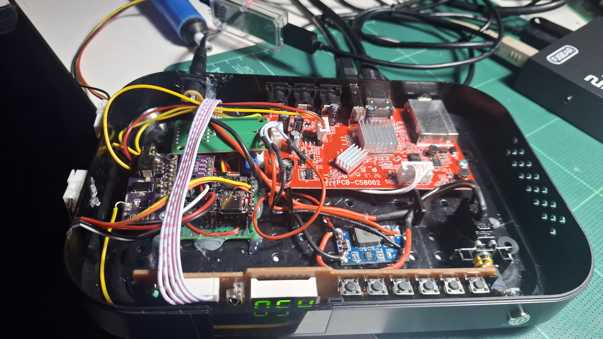
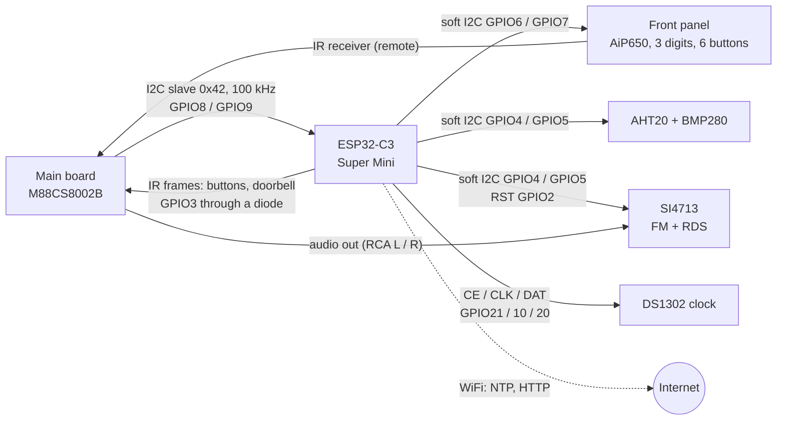

# BriMod: ESP32-C3 bridge for the satellite box

**BriMod** is the satellite box ([`../../sat/`](../../sat/README.md)) with an
ESP32-C3 Super Mini added between its main board and its front panel. The
ESP32 becomes the only device on the box's I2C bus and adds a clock, a
climate sensor, an FM transmitter with RDS and WiFi. NCAPPS finds it by
itself; apps keep using the front display and buttons as before.



*BriMod inside the satellite box (lid off): the red main board
`PCB-CS8002`, the ESP32-C3 Super Mini on a small perfboard, the add-on
modules (SI4713 FM board, sensors, clock) and the front panel board, which
now hangs off the ESP32.*

## Why a bridge

The front panel chip (AiP650 / FD650) is not a real I2C device: it
acknowledges every byte on the bus, including bytes the box tries to read
from other devices. So nothing else can share the box's only free I2C bus
with it. The ESP32-C3 has one hardware I2C controller, which it uses as a
**slave** for the box; the panel and the add-ons get their own software I2C
buses on other pins.



What the box gets from it:

| | How |
|---|---|
| Front display, green LED | box writes the 4 digit registers, ESP32 copies them to the AiP650 |
| Front buttons | ESP32 reads them and sends NEC IR frames (user code `0xA55A`) on the box's IR line; the SDK turns them into `BTN_*` |
| Doorbell | an IR frame with user code `0xA55B` tells the box that an event happened (mailbox command done, ...) |
| Clock | DS1302 (keeps time without power) + NTP over WiFi, time zone |
| Climate | AHT20 temperature / humidity, BMP280 pressure / temperature |
| FM transmitter | SI4713: frequency, power, antenna, stereo / mono, pre-emphasis, deviations, line input, limiter, compressor, RDS (name, RadioText, PI, PTY, TP, TA, AF, clock time); settings survive power-off |
| WiFi | connect / scan / forget, NTP, HTTP GET through text commands |
| Spare | GPIO0 / GPIO1 (ADC in mV, or digital out), extra I2C parts on the sensor bus |

## Parts

- ESP32-C3 Super Mini
- AHT20 + BMP280 combo board (I2C)
- SI4713 FM transmitter board (I2C) with an antenna wire
- DS1302 clock module (pins VCC, GND, CLK, DAT, RST) with a CR2032
- 1 Schottky diode (IR line), 4.7 kOhm pull-ups for each I2C bus that has
  none, 10 kOhm pull-up on GPIO2
- the satellite box's own front panel board (`650G11B`)

## Wiring

| ESP32-C3 | Goes to | Notes |
|---|---|---|
| GPIO8 | box front connector **SDA** | box link, hardware I2C slave. Also the onboard LED (flickers with traffic) |
| GPIO9 | box front connector **SCL** | strapping pin (BOOT button): the 4.7 kOhm pull-up keeps it high at start |
| GPIO3 | box front connector **IR**, through a Schottky diode | diode cathode to GPIO3, anode to the IR line: the ESP32 can only pull the line low, the remote keeps working |
| GPIO6 / GPIO7 | front panel board SDA / SCL | software I2C, 100 kHz |
| GPIO4 / GPIO5 | AHT20 + BMP280, SI4713: SDA / SCL | software I2C, 100 kHz |
| GPIO2 | SI4713 RST | strapping pin: 10 kOhm pull-up to 3.3 V |
| GPIO21 | DS1302 RST (= CE) | also UART0 TX: the boot messages toggle it |
| GPIO10 | DS1302 CLK | |
| GPIO20 | DS1302 DAT | |
| GPIO0 / GPIO1 | free | ADC (registers `0x38-0x3B`), mailbox `PIN` / `GET` |
| GND | box GND | common ground for everything |

The box's front connector (main board) is `SCL, SDA, GND, IR, 3.3 V`. The
panel board keeps its own IR receiver wired to the box's IR pin, so the
remote goes to the box directly as before. Feed the box's analog audio
(RCA L / R) into the SI4713's line input, divided down if the level is too
high (the FM page in the app shows the input level and overmodulation).

**Download mode trap:** if the ESP32 restarts while the box is off, the
unpowered box pulls GPIO9 low and the ESP32 stays in download mode. Press
RESET with the box on.

## Build and flash

Arduino IDE with the esp32 core 3.x (3.3.10 used), no extra libraries:

- Board: **ESP32C3 Dev Module** (or "Nologo ESP32C3 Super Mini")
- Tools, USB CDC On Boot: **Enabled**. The log is on the USB-C port at
  115200; GPIO20 / 21 are the DS1302 here, not a UART.

Or with arduino-cli:
```
arduino-cli compile --fqbn esp32:esp32:esp32c3:CDCOnBoot=cdc esp32c3/bridge
arduino-cli upload  --fqbn esp32:esp32:esp32c3:CDCOnBoot=cdc -p COMx esp32c3/bridge
```

If the upload does not start: hold BOOT, tap RESET, release BOOT. Start-up
log:
```
bridge: NCAPPS ESP32-C3 bridge starting
bridge: present 0x.. (AHT20 1, BMP280 1 at 0x76, SI4713 1, DS1302 1, panel 1)
```
A `0` there is a part the ESP32 did not find. The panel shows `---` until
the box writes to it.

## On the box

- **SDK driver** [`../../sdk/brimod.h`](../../sdk/brimod.h) /
  `brimod.c`, linked into every SDK app. At start the runtime reads the
  front panel chip's key register; only when that fails (no AiP650 on the
  bus) does it ask address `0x42` for `NCB1`. A box wired as shipped never
  sees a BriMod transfer. With the bridge (`sdk_brimod = 1`) the panel and
  LED calls go to the bridge and its IR frames become buttons, so the
  launcher and all apps work unchanged.
- **BriMod app** ([`../../apps/brimod/`](../../apps/brimod/brimod.c), in the
  NCAPPS menu): status page, WiFi (scan, on-screen keyboard for the
  password), every FM / RDS setting with a live input level meter, clock
  (time zone, NTP, set by hand), restart the bridge.
- **Own code:** `brimod_time`, `brimod_climate`, `brimod_fm_get` /
  `brimod_fm_write`, `brimod_si_get` / `brimod_si_set`, `brimod_rds_set`,
  `brimod_wifi_*`, `brimod_cmd ("HTTP http://...")`, `brimod_doorbell`, ...

## Link protocol

I2C slave, 7-bit address `0x42`, 100 kHz, little-endian values.

- **write:** `{reg, data...}`, data goes to `reg`, `reg + 1`, ...
- **read:** write `{0xFF, reg, n}`, STOP, wait at least 200 us (the SDK
  waits 300), then read exactly `n` bytes (`n` up to 32). The ESP32
  prepares the reply when the request arrives and holds SCL low until it
  is ready.

| Registers | |
|---|---|
| `0x00-04` | magic `NCB1`, firmware version |
| `0x05` | parts found: AHT20, BMP280, SI4713, DS1302, panel, WiFi connected, time valid |
| `0x06-09` | events (write 1 to clear), doorbell mask |
| `0x0A` | config: front buttons as IR, ESP32 drives the panel, doorbell on |
| `0x0B-0F` | last panel key register, uptime |
| `0x10-16` | Unix time (write = set clock + DS1302), time zone in minutes, time source |
| `0x20-29` | AHT20 temperature / humidity, BMP280 pressure / temperature |
| `0x30-33` | FM noise, antenna capacitor in use, audio input flags and level |
| `0x38-3D` | ADC GPIO0 / GPIO1, chip temperature |
| `0x40-45` | FM frequency, power, flags (on air, RDS, mono), antenna, RDS options (clock time) |
| `0x46-8F` | RDS PI, station name (8), RadioText (64) |
| `0x90-93` | SI4713 property window (deviations, line input, pre-emphasis, limiter, compressor, PS mix / misc, AF) |
| `0xA0-A4` | front panel digit registers, panel control |
| `0xC0-C8` | mailbox: command / status, reply length, counter, reply offset / bytes |
| `0xF0` | write `0xA5` = restart |

The full map with every bit is in the header of
[`bridge.ino`](bridge.ino).

**Mailbox** (text command in, text reply out, for slow jobs): `PING`,
`VER`, `WIFI ssid password` (or `WIFI<tab>ssid<tab>password` for names
with spaces), `WIFI?`, `WIFIOFF`, `SCAN`, `NTP [tz]`, `HTTP url`, `FMSCAN`,
`FMDEFAULTS`, `I2CW` / `I2CR` / `I2CWR` (sensor bus), `PIN` / `GET`
(GPIO0 / 1). The WiFi password is stored in the ESP32 (NVS) and never
written to the log.

**Kept over power-off (NVS):** WiFi network, time zone, all FM / RDS
settings and SI4713 properties (saved 3 s after the last change, applied at
start, so the transmitter comes back on by itself).

## Status

2026-09-30: firmware, SDK driver and app built; bring-up on the box in
progress. Not verified yet: that the box's I2C controller waits while the
ESP32 holds SCL low, and RDS clock time next to a full 64-character
RadioText. Full notes: [`../../sat/NOTES.md`](../../sat/NOTES.md).

Keep the transmitter's power low and on a free frequency; FM broadcasting
rules differ by country.
