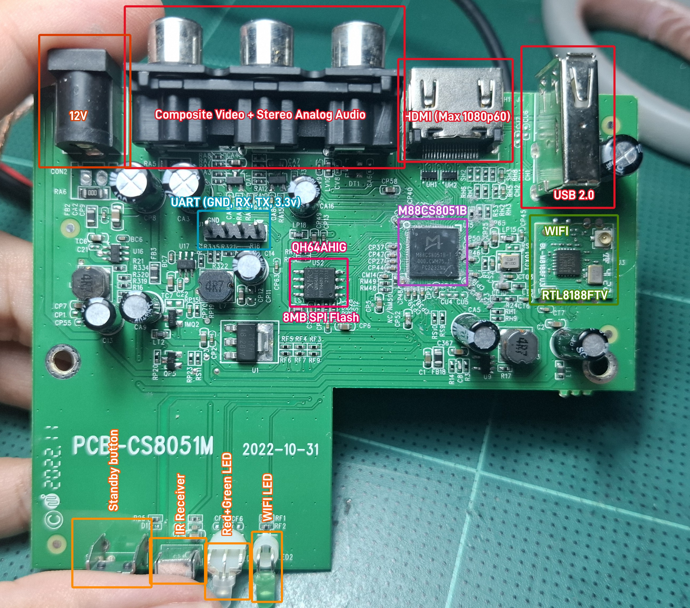
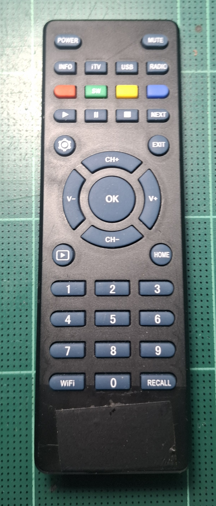

# IPTV box (M88CS8051B)

The first box of this project: a small internet-TV (IPTV) box with WiFi,
HDMI and one USB port, sold with its own remote. There is no broadcast tuner
and no Ethernet on the board. It runs NCAPPS (launcher, SDK apps, DOOM) from
a USB stick; without the stick it boots its stock firmware as before.

*Main board `PCB-CS8051M` (2022-10-31), top side. Labels: power, AV outputs,
HDMI, USB, UART header, SoC, SPI flash, WiFi module, front-edge parts.*

## Hardware

| Part | What |
|---|---|
| Board | `PCB-CS8051M`, dated 2022-10-31 |
| SoC | Montage **M88CS8051B** (the firmware calls the family `cs8001b`, model string `Model_06_cs8001b_128m_iptv`): MIPS 24KEc ~648 MHz, little-endian, 16 KB I + 16 KB D cache, no FPU, DSP ASE rev 1, MIPS16e; a second core runs the AV decoder firmware |
| RAM | 128 MB DDR2, no separate RAM chip on the board (U-Boot manages 20 MB of it) |
| Flash | 8 MB SPI NOR, XM25QH64A (SOIC-8, next to the SoC) |
| WiFi | RTL8188FTV module (USB, on U-Boot's root port 1) with antenna |
| Video out | HDMI (up to 1080p60), composite (CVBS) |
| Audio out | stereo analog (RCA), HDMI |
| USB | one USB 2.0 type A (root port 0) |
| Power | 12 V DC jack |
| Front | STANDBY button, IR receiver, red + green power LED, WiFi LED (all on the board's front edge) |
| Console | 4-pin UART header: GND, RX, TX, 3.3 V; **38400 baud** 8N1, U-Boot 2012.04 (Nov 21 2022 build), 3 s boot delay |

Connect only GND, RX and TX of a 3.3 V USB-serial adapter; leave the 3.3 V
pin alone (the box powers itself).

## Remote

NEC protocol, user code `0xfe01`, read by the SoC's IR block (`ir.h`). Key
codes are in `../remoteir.txt` and `../ir.h` (`IR_KEY_*`). In NCAPPS:
arrows / CH / V = UP DOWN LEFT RIGHT, OK, EXIT = back, HOME, the gear key =
MENU (settings), colour keys, play / pause / stop / next, digits, MUTE
toggles the performance overlay, POWER = standby.

## Flash layout

| Offset | Contents |
|---|---|
| `0x000000` | first-stage boot |
| `0x010000` | U-Boot |
| `0x0A0000` | boot script, **replaced by `scripts/ncboot.scr`** |
| `0x0B0000` | AV core firmware (LZMA) |
| `0x130000` | 1280x720 PNG |
| `0x300000` | stock main firmware (LZMA, runs at `0x80008000`) |
| `0x700000` | boot ad video, first 64 KB erased (the stock firmware then shows its fallback splash) |
| `0x7B0000..` | other firmware data (untouched) |

Keep the full dump (`backup.bin`, 8 MB) on the stick: it is the only way
back. It is gitignored because it holds saved WiFi passwords and the
vendor's code.

## Boot

`scripts/ncboot.txt` (built to `ncboot.scr` by `../mkscript.py`, flashed
at `0xA0000`) reads `NCAPPS/SETTINGS.TXT` from the stick, patches U-Boot's
display mode to 1080p, starts the AV core and HDMI, and runs
`NCAPPS/LAUNCHER.BIN`. Without the stick it boots the stock firmware at
1080i. `scripts/ncbig.txt` is the "big memory" variant (the AV core gets
8 MB of video memory, apps get ~95 MB of heap). Restoring the stock boot
script: main README, "Boot flow".

## What works here

| | |
|---|---|
| NCAPPS launcher, SDK apps, DOOM, audio | yes |
| HDMI 1080p60 / 1080p50 / 1080i50 (launcher setting) | yes, 1080p60 verified |
| STANDBY button and LEDs (`../board.h`) | yes |
| WiFi from bare metal (`../rtl*.c`, `../wlan.h`, `../wpa.h`, `../netstack.h`) | scan, WPA2 join, DHCP, ping, DNS, HTTP GET |
| Code inside the stock firmware (`hooks/`, `scripts/hook*.txt`) | draws, snapshots, IR and audio taps |
| Hardware video decoding | experiments only (`hooks/vdectest.c`) |

## This folder

| Path | What |
|---|---|
| `scripts/` | U-Boot scripts (`.txt` sources; `.scr` built by `mkscript.py`): `ncboot` / `ncbig` (NCAPPS boot), `avstart`, `wifijoin`, `wifinet`, `httpget`, `hook*`, `vdectest` |
| `hooks/` | code patched into the stock firmware or U-Boot (`fwpatch`, `hookpatch`, `usbfast`, `hook_*`, `vdectest`) |
| `firmware/` | flash dump and images extracted from it (gitignored) |
| `logs/` | serial captures (gitignored) |

The full lab notebook for this box is `../continue.md`; which program runs
on which box is in `../BOXES.md`.
