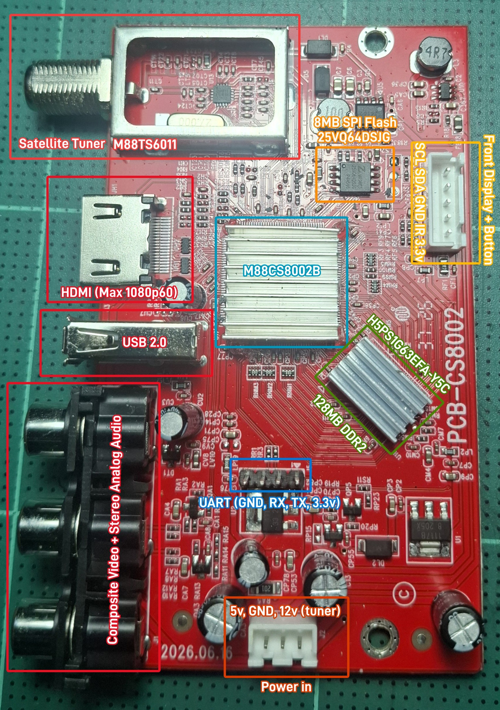
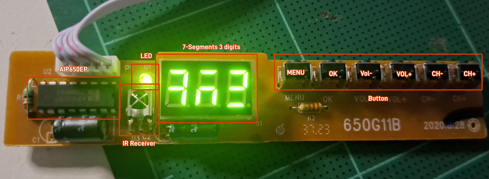
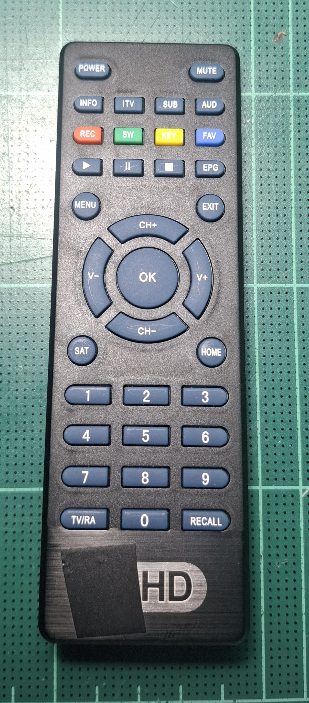

# Satellite box (M88CS8002B)

The second box: a DVB-S satellite receiver with HDMI, one USB port, a
3-digit LED front panel and its own remote. Same CPU family and U-Boot as
the IPTV box, so NCAPPS (launcher, SDK apps, DOOM) runs here from the same
USB stick; without the stick it boots its stock firmware as before. The
tuner is not used by NCAPPS.

*Main board `PCB-CS8002`. Labels: satellite tuner, HDMI, USB, AV outputs,
SoC and RAM (under heatsinks), SPI flash, UART header, front panel and
power connectors.*

## Hardware

| Part | What |
|---|---|
| Board | `PCB-CS8002` |
| SoC | Montage **M88CS8002B** (the firmware calls it `cs8001b 64m`, model string `Model_02_cs8001b_64m_internet`): MIPS 24KEc ~648 MHz, same core, caches, DSP ASE and speed as the IPTV box; a second core runs the AV decoder firmware |
| RAM | 128 MB DDR2, Hynix H5PS1G63EFR-Y5C (the stock AV layout uses only the low 64 MB; NCAPPS puts its heap in the upper 64 MB) |
| Flash | 8 MB SPI NOR, 25VQ64DSJG (SOIC-8) |
| Tuner | DVB-S, Montage M88TS6011 in the shielded can, F connector |
| Video out | HDMI (up to 1080p60), composite (CVBS) |
| Audio out | stereo analog (RCA), HDMI |
| USB | one USB 2.0 type A |
| Power | from a separate power board, 3-pin connector: 5 V, GND, 12 V (the 12 V feeds the tuner) |
| Front | 5-pin connector to the front panel board: SCL, SDA, GND, IR, 3.3 V |
| Console | 4-pin UART header: GND, RX, TX, 3.3 V; **38400 baud** 8N1, U-Boot 2012.04 (May 09 2026 build) |

Connect only GND, RX and TX of a 3.3 V USB-serial adapter; leave the 3.3 V
pin alone (the box powers itself).

## Front panel

*Front panel board `650G11B`: AiP650EP driver, green LED, IR receiver,
3-digit 7-segment display, six buttons.*

- **AiP650EP** (FD650 / TM1650 protocol) on the SoC's I2C channel 2
  (`0xbf158000`, pinmux `0xbf15b400` = `0x33`), 100 kHz. Drivers:
  `../i2c.h`, `../fd650.h`; test program `../fptest.c`.
- Digits left to right = digit registers 2, 3, 1; the green LED is register
  1 bit 3. Segment wiring is not standard (`fd650_map`).
- Buttons (key code, bit 6 = pressed): MENU `0x05`, OK `0x2d`, VOL- `0x15`,
  VOL+ `0x1d`, CH- `0x25`, CH+ `0x35`. NCAPPS maps them to MENU, OK, LEFT,
  RIGHT, DOWN, UP.
- The IR receiver's output goes straight to the main board (IR pin).
- The AiP650 is not a real I2C device: it acknowledges every byte, so no
  other I2C part can share this bus. For extra hardware see BriMod below.

## Remote

Same layout, protocol (NEC, user code `0xfe01`) and key codes as the IPTV
box's remote (`../remoteir.txt`, `../ir.h`); only some labels differ (REC /
SW / KEY / FAV on the colour keys, SUB, AUD, EPG, MENU, SAT, TV/RA).

## BriMod (optional)

"BriMod" = this box with an ESP32-C3 bridge between the main board and the
front panel: the ESP32 is the only device on the box's I2C bus (address
`0x42`), drives the AiP650 on its own bus, sends the front buttons as IR
frames, and adds a clock (DS1302 + NTP), a climate sensor (AHT20 +
BMP280), an SI4713 FM transmitter with RDS, and WiFi. Firmware:
`../esp32c3/bridge/bridge.ino`; SDK driver: `../sdk/brimod.h`; settings
app: `../apps/brimod/`. The SDK detects it at start; a box wired as shipped
keeps the normal front panel code.

## Flash layout

| Offset | Contents |
|---|---|
| `0x000000` | first-stage boot |
| `0x010000` | U-Boot |
| `0x0A0000` | boot script, **replaced by `scripts/ncboot.scr`** |
| `0x0B0000` | AV core firmware (size + LZMA) |
| `0x300000` | stock main firmware (header + LZMA, runs at `0x80008000`) |
| `0x5C0000..` | settings / channel data (untouched) |

The full 8 MB dump (`flash_s2.bin`, gitignored) is the way back; keep a copy
on the stick.

## Boot

`scripts/ncboot.txt` (built to `ncboot.scr` by `../mkscript.py`, staged on
the stick as `satboot.scr`, flashed at `0xA0000`) reads
`NCAPPS/SETTINGS.TXT`, patches U-Boot's display mode for 1080p, starts the
AV core and HDMI with this box's 64 MB AV memory map, and runs
`NCAPPS/LAUNCHER.BIN`. Without the stick it boots the stock firmware.

## What works here

| | |
|---|---|
| NCAPPS launcher, SDK apps, audio | yes |
| DOOM | yes, ~70 fps |
| HDMI 1080p60 / 1080p50 / 1080i50 (launcher setting) | yes, 1080p50 and 1080p60 verified |
| Front display, LED, buttons (`sdk_panel_*`, `sdk_key_poll`) | yes |
| I2C bus for apps (`sdk_i2c_*`, 100 / 400 kHz) | yes, but only without the AiP650 on it (see above) |
| Heap for apps | 66 MB |
| Satellite tuner, Ethernet | not used |

## This folder

| Path | What |
|---|---|
| `NOTES.md` | everything found on this box (flash, boot script, I2C, front panel, IR, memory map, BriMod) |
| `scripts/ncboot.txt` | NCAPPS boot script for this box |
| `frontkey.txt` | front button codes as read from the AiP650 |
| `ubmatch.py` | finds U-Boot functions of this build by matching the IPTV box's |
| `logs/` | serial captures |
| `flash_s2.bin`, `ubsat.bin`, `app_s2.bin`, `avcpu_s2.bin` | flash dump and images extracted from it (gitignored) |

Which program runs on which box: `../BOXES.md`.
