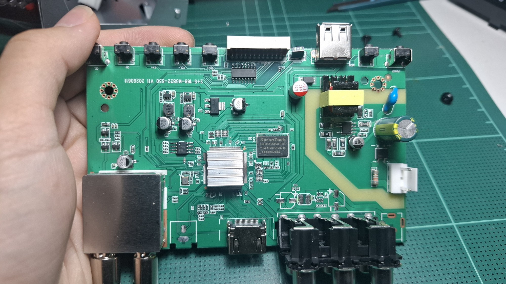
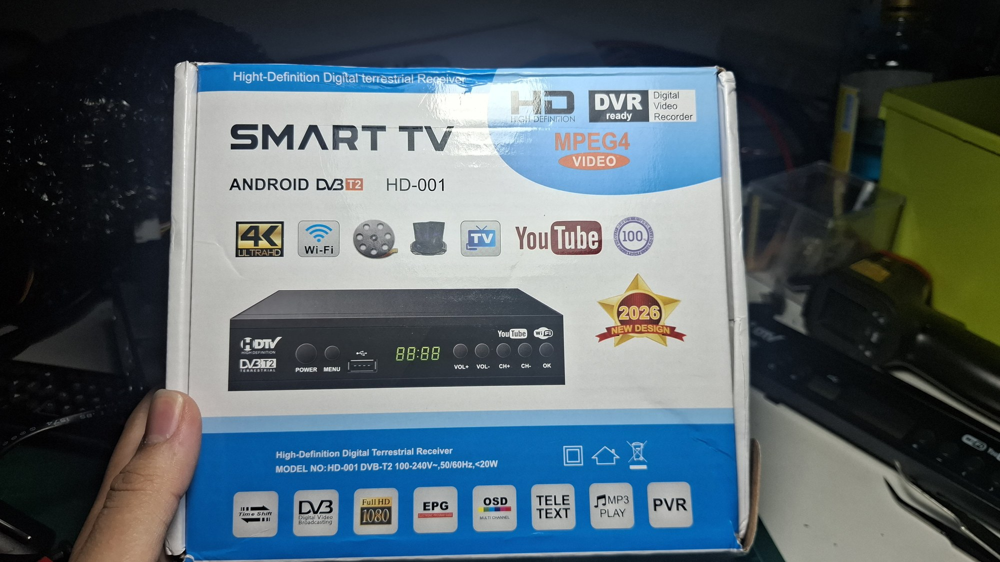
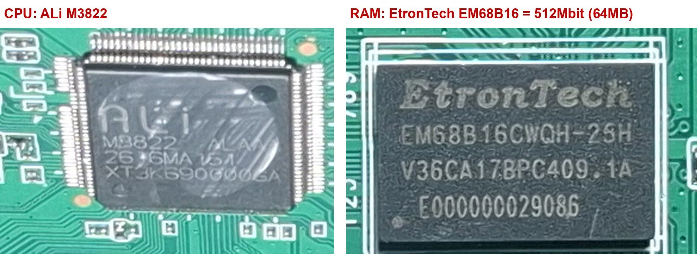
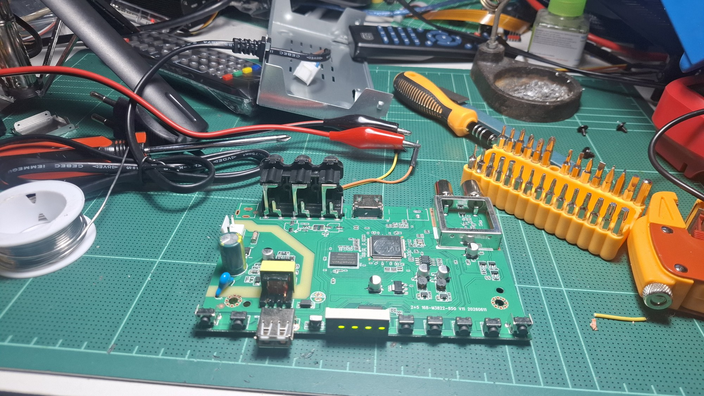

# T2 box (ALi M3822): a dead end

The third box: a cheap DVB-T2 receiver sold as "SMART TV ANDROID DVB-T2
HD-001" (365 baht). The plan was to run NCAPPS on it like on the IPTV and
satellite boxes. It turned out to be a different chip family with no way in
through software, and the board did not survive the attempt to read its
flash. This page records what was found, so the next box goes better.

*Main board `2+5 168-M3822-850 V11 20260611`: SoC under the heatsink, RAM
right of it, mains power supply inside the yellow isolation outline on the
right, tuner bottom left, buttons along the top edge.*

## Listing vs. reality

| The listing / box says | The board has |
|---|---|
| Android | no: ALi's own set-top-box firmware (menu: System, Wi-Fi, Upgrade, Information) |
| 4K | no: the SoC is a Full HD chip, and the box itself also says "Full HD 1080" |
| 512 MB | **64 MB** DDR2: EtronTech EM68B16CWQH-25H = 512 **Mbit** |
| Montage MT2203 | **ALi M3822** |

## Hardware

| Part | What |
|---|---|
| SoC | ALi M3822, LQFP (~128 pins), glued heatsink |
| RAM | 64 MB DDR2 (EtronTech EM68B16CWQH-25H, x16) |
| Flash | SOIC-8 SPI NOR left of the SoC, most likely 4 MB (marking partly readable, never read out) |
| Power | mains flyback supply **on the main board** (no separate power board), output about 5 V |
| Outputs | HDMI, composite + stereo audio (RCA), USB 2.0 |
| Tuner | DVB-T2/C, RF in and loop-through out |
| Front | 4-digit LED display, 7 buttons (POWER, MENU, VOL+/-, CH+/-, OK), IR receiver, all on the main board |
| Console | **none**: no UART header, no test pads (every via on the bottom is covered by solder mask) |
| Remote | 43 keys, codes differ from the IPTV / satellite remotes (not decoded yet) |

## What was tried

1. **Power without mains:** the USB port's 5 V pin is the board's 5 V rail,
   so 5 V from a phone charger fed into the USB port (backfeed) runs the
   board with the mains side dead. Safe for probing.
2. **Firmware menu:** Software Update only offers "USB Upgrade"; no backup
   or dump. A 62 GB FAT32 stick was not detected.
3. **UART:** no header or pads anywhere; the UART only exists on SoC pins.
   An unconfirmed lead (from a web search, for the related M3821): TX pin
   114, RX pin 115. Not probed.
4. **Flash dump with an FT232H** (`spiflash.py`, wiring in
   `flash_pinout.png`). In-circuit reading does not work on this board:
   - FT232H 3V3 on the flash's VCC pin: that pin is the whole board's 3.3 V
     rail, so the levels collapse to ~1.7 V;
   - board's 3.3 V from a bench supply (0.3 A): SCK / MOSI still only ~2 V,
     full swing only with the wire to the board removed: the unpowered ALi
     chip holds its SPI pins low;
   - board running: the ALi chip clocks the flash about every 12 us, all
     the time, so it never lets go of the bus.
5. **Removing the flash** with only a soldering iron failed; after
   resoldering the board stayed dead (0.1 A instead of 0.5 A at 5 V). The
   board was then broken up. The case now holds a Raspberry Pi 5.

## Lessons

- Before buying a box to hack, find out the chip: ask the seller for a
  board photo, or search the model with "firmware" / "upgrade" (file names
  like `ali`, `m3821`, `gx6605`, `msd7`, `cs8001b` give it away). Specs like
  "Android" and "4K" on a very cheap T2 box are a warning sign.
- The two working boxes use Montage `cs8001b`-family chips with U-Boot;
  that is what makes NCAPPS possible on them.
- On boards where the SoC keeps using the SPI flash, reading it in circuit
  does not work. Take the chip off with hot air or low-melt solder (or a
  phone repair shop), never by pulling before every leg is liquid.

## Files

| File | What |
|---|---|
| `NOTES.md` | the detailed notes, measurements included |
| `spiflash.py` | read / write SPI NOR flash with an FT232H (pyftdi): `id`, `read` (twice + compare), `write` (erase, program, verify), `loopback` self-test. Reusable for any board |
| `flash_pinout.png` | SOIC-8 flash pins on this board with the FT232H wiring |
